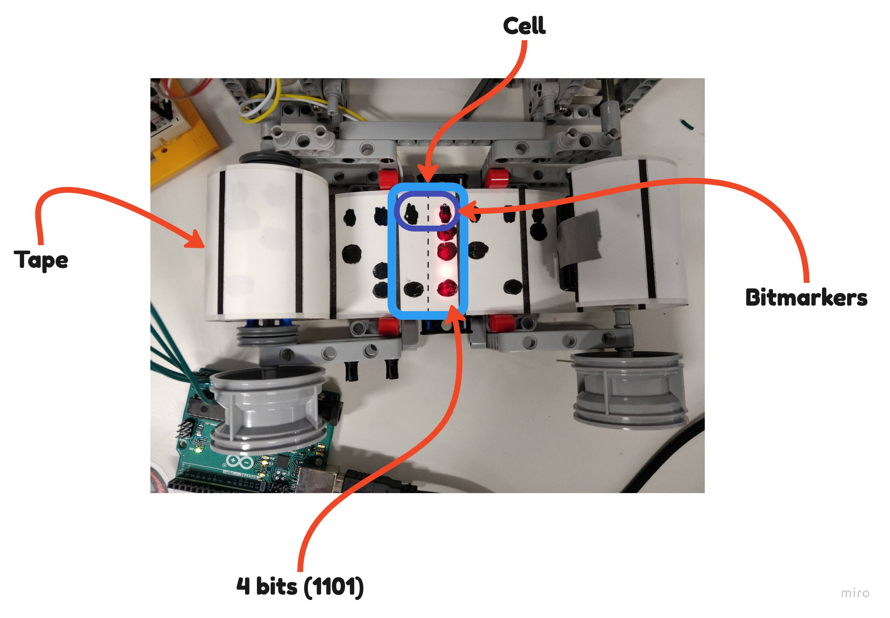

# BH2023

Bath Hack 2023

# **RISC-iest Tape Computer**

A **Turing Complete** Tape & ATMega general purpose. The tape is a physical strip of paper with binary nibbles written on it using our own (extra-reduced) instruction set, detailed at bottom. The ATMega executes interpeted opcodes & operands.

## _Key Points:_

-   System memory is **all on Tape** - program & data stored as sets of nibbles.
-   Only used ATMega as Head, using only processing power & registers.  (**no on-board memory**)
-   Implemented fully in **_AVR assembly_**, as programming the ATMega in C would use its on-board memory.

 

# **DEMO**

A caesar cipher implemented using general purpose (extra-reduced) instruction set.

## _Abstract_

1.  Fetch next data item  
    a. if character, decrypt and display to 7-segment display 
    b. if number != 0, set as cipher key 
    c. if number == 0, halt program

## _Example_

| **Input** Data: | 12  | 'V' | 'S' | 'Z' | 'Z' | 'C' | 0   |
| --------------- | --- | --- | --- | --- | --- | --- | --- |

-   cipher key = 12  
-   cipher-text data = "VSZZC"  
-   halt key = 0
     

| **Output** on 7-segment Display: | "HELLO" |
| -------------------------------- | ------- |

 

# **Tape Structure**

The high level layout of the tape is as follows. It contains an initial section of the tape which is the program followed by a section for the data.   

The information on the tape itself is broken down into 1 byte per cell. For 1 instruction using our instruction set, it takes 2 bytes(2 cells). The first 4 bits represent the opcode(instruction) and there are 2 operands which are 6 bits each; together, the opcode and operands make the 2 bytes.   

Below is a picture specifically looking at 1 cell of the tape and how it's broken down.   

## FWKB-I (Instruction set)

The following is a table of our instruction set, and the binary representation of each instruction. It's composed of 14 instructions and is Turing complete.  

| Instruction | 4-bit Binary | Description                                                                           |
| ----------- | ------------ | ------------------------------------------------------------------------------------- |
| HALT        | 0000         | Halt the program                                                                      |
| LOAD        | 0001         | Load the value into the specified register                                            |
| ADD         | 0010         | Add the values of the 2 specified register                                            |
| ADDK        | 0011         | Add constant k to the value of the specified register                                 |
| SUB         | 0100         | Subtract the values of the 2 specified register                                       |
| SUBK        | 0101         | Subtract constant k from the value of the specified register                          |
| COMP        | 0110         | Compare constant k to the specified register                                          |
| iLESS       | 0111         | If the specified register is less than k, jump to the next instruction                |
| iEQIV       | 1000         | If the specified register is equal to k, jump to the next instruction                 |
| iGEQ        | 1001         | If the specified register is greater than or equal to k, jump to the next instruction |
| JUMP        | 1010         | Jump to the specified location                                                        |
| COPY        | 1011         | Copy the value from one register to another                                           |
| LOADK       | 1100         | Load constant k into the specified register                                           |
| DISP        | 1101         | Display the value of the specified register on the 7-segment display                  |

## Files

1. **abstract.py** The initial workspace for conceptualising the program (Python)   
2. **main.asm** The assembly code for simulating out the program (AVR)   
3. **tape.bin** is the binary code for the physical tape which represents the program and the data   
4. **nibbles.bin** is the binary code from tape broken down into nibbles
